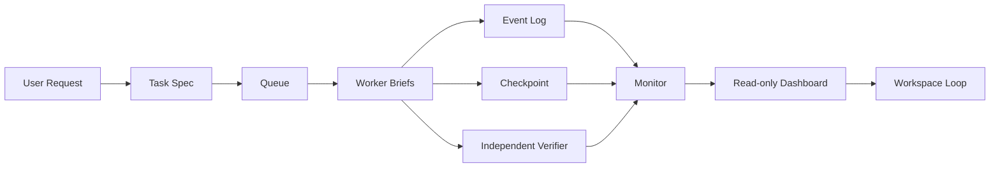

# Multi-Agent Orchestrator Skill

Coordinate logical multi-agent work inside one AI coding tool with Task Specs, Worker Briefs, checkpoints, independent verification, a read-only dashboard, and now a workspace-level timed Loop.

> 中文简介：这是一个面向 Codex、ClaudeCode、OpenClaw 等 AI 编程工具的多 Agent 协同 Skill。它不创建真实后台服务，而是在同一个 AI 工具会话里，用 Coordinator / Worker / Verifier / Monitor / Dashboard / Loop 这些逻辑角色，把长任务拆解、执行、校验、恢复和看板展示标准化。

[](https://github.com/lazze2026/multi-agent-orchestrator-skill)
[](LICENSE)
[](SKILL.md)
[](references/loop-v1-design.md)
[](tests/simulations/dashboard-static-html/)


## Why This Project Exists

Long AI-agent tasks usually break down in familiar ways:

- the tool loses track of what is already done
- verification gets polluted by the worker's own conclusions
- partial output is forgotten after context compaction
- a blocked worker becomes invisible until a human asks
- dashboard refresh is manual and state drift goes unnoticed

This project gives one AI tool a lightweight operating model:

- plan first
- execute inside explicit scope
- log every transition
- checkpoint partial progress
- verify independently
- surface status in a read-only board
- optionally run a timed Loop that checks the workspace every few minutes

## What Makes It Different

Most "multi-agent" demos either hand-wave the protocol or jump straight to autonomous background systems. This Skill stays practical:

- **single-tool only**: no fake distributed architecture
- **event-first**: queue and dashboard are derived, not authoritative
- **authorization-aware**: no silent write expansion
- **verifier-separated**: implementation and verification do not share judgment
- **Loop with guardrails**: dry-run, one-cycle execution, incremental rebuild, scheduled full validation, and no automatic business writes

## New in v1.4.0

Workspace Loop v1 is now implemented.

- `scripts/loop_runner.py` for one bounded workspace cycle
- `--dry-run` mode for policy preview without writes
- `--once` mode for heartbeat-friendly execution
- `scripts/simulate_loop.py` for future-cycle prediction
- stale detection based on missing heartbeat or progress events
- explicit safe actions:
  - `status_update_to_running`
  - `status_update_to_verifying`
  - `verifier_trigger`
- incremental queue rebuild plus full rebuild validation every 12 cycles by default
- stale lock holder detection with `lock.release.requested`, but no default auto-release

## At a Glance

What you get out of the box:

- **Task Spec first**: scope, authorization, risk, allowed paths, forbidden actions, deliverables, acceptance criteria
- **Worker Briefs**: bounded work cards with dependencies and reporting format
- **State machine**: `queued`, `running`, `partially_completed`, `blocked`, `verifying`, `done`, `needs_human_decision`
- **Event log**: append-only events with `caused_by` and `trigger_event_id`
- **Checkpoint recovery**: resumable long-running work with idempotency checks
- **Independent Verifier**: checks deliverables from task spec, not worker self-assessment
- **Monitor warnings**: lock conflicts, stale agents, queue pressure, rate limits, fallback decisions
- **Read-only dashboard**: tasks, agents, blockers, swimlanes, dispatch actions, checkpoints, recent events
- **Workspace Loop v1**: periodic observation and cautious auto-advance with audit trails

## Quick Start

Clone into a shared skills directory:

```bash
git clone https://github.com/lazze2026/multi-agent-orchestrator-skill.git ~/.shared-skills/multi-agent-orchestrator
```

Link or copy it into your tool's skills folder:

```text
~/.codex/skills/multi-agent-orchestrator
~/.claude/skills/multi-agent-orchestrator
~/.openclaw/skills/multi-agent-orchestrator
```

Ask your AI tool to use it:

```text
Use multi-agent-orchestrator to split this long-running task into Task Spec, Worker Briefs, event log, checkpoint, verifier report, dashboard state, and a workspace Loop plan.
```

## Workspace Loop v1

Loop v1 turns an orchestrator workspace into a timed, auditable cycle. It reads state, appends Loop events, rebuilds queue snapshots, refreshes the dashboard, and only auto-advances explicitly allowed low-risk tasks.

Preview the next cycle without writing files:

```bash
python scripts/loop_runner.py ./workspace --dry-run
```

Run one bounded cycle:

```bash
python scripts/loop_runner.py ./workspace --once
```

Simulate the next 10 cycles without mutating the source workspace:

```bash
python scripts/simulate_loop.py ./workspace --cycles 10 --output simulation.json
```

Loop guardrails:

- no business deliverable writes
- no lock auto-release by default
- no verifier trigger without plan and artifacts
- no status jump without explicit safe action
- full rebuild validation every 12 cycles by default

## Dashboard Demo

A static demo is included:

```bash
python -m http.server 8765 --bind 127.0.0.1 --directory tests/simulations/dashboard-static-html
```

Open:

```text
http://127.0.0.1:8765/index.html
```

The dashboard reads only `state.json`. It does not mutate queue, events, locks, reports, checkpoints, or task status.

Current dashboard capabilities:

- KPI cards through `summary.metrics`
- richer Agent cards with `current_work`, `detail`, and `last_observed`
- horizontal gantt-like flow timeline
- generic `entity_grid` for batch/module/shard/task matrix views
- localized rendering through `display_dictionary`
- friendlier event names through `event_display_rules`
- optional business-specific display additions through `domain_extensions`
- Loop section with cycle summary, health, and recent Loop events

## Generate Dashboard State

Requirements:

- Python 3.9+
- standard library only

Generate `state.json` from an orchestrator workspace:

```bash
python scripts/generate_dashboard_state.py ./workspace
```

Custom output:

```bash
python scripts/generate_dashboard_state.py ./workspace --output ./workspace/dashboard/state.json --refresh-interval 180
```

Validate a dashboard state file:

```bash
python scripts/validate_state.py ./workspace/dashboard/state.json
```

## Best Fit

Use this Skill for:

- long-running AI coding tasks that need checkpoints
- batch work split by date range, module, file set, or data shard
- risky changes where implementation and verification should stay separate
- workflows with dependencies, locks, partial completion, or cancellation risk
- teams who want a visible Agent/task board while one AI tool coordinates the work
- workspace-level periodic review with a cautious Loop instead of a free-running autonomous agent

Avoid it for:

- simple one-step tasks under about 10 minutes
- highly interactive work that needs constant user input
- work without clear authorization or acceptance criteria
- cross-tool orchestration

## Typical Workflow



## Repository Map

```text
multi-agent-orchestrator-skill/
|-- SKILL.md
|-- agents/openai.yaml
|-- references/protocol.md
|-- references/loop-v1-design.md
|-- references/loop-v1-design.zh-CN.md
|-- references/templates/
|-- scripts/
|   |-- generate_dashboard_state.py
|   |-- validate_state.py
|   |-- loop_runner.py
|   |-- simulate_loop.py
|   `-- dashboard
|-- tests/
|   |-- test_loop_runner.py
|   |-- test_simulate_loop.py
|   `-- simulations/
`-- docs/
    |-- install-codex-claudecode-openclaw.md
    `-- images/
```

## Core Safety Rules

- `auto-approve` is not write authorization
- worker completion is not final completion; Verifier must review it
- Verifier must not inherit Worker conclusions
- dashboard is read-only
- Loop may request lock release, but must not treat a request as approval
- priority cannot bypass authorization, locks, dependencies, or verification
- cancellation is not rollback; any deletion, overwrite, or DB rollback is a separate authorized write action

## Documentation

- [Skill entry point](SKILL.md)
- [Full protocol](references/protocol.md)
- [Workspace Loop v1 design](references/loop-v1-design.md)
- [Workspace Loop v1 design, zh-CN](references/loop-v1-design.zh-CN.md)
- [Install for Codex, ClaudeCode, and OpenClaw](docs/install-codex-claudecode-openclaw.md)
- [Dashboard simulation](tests/simulations/dashboard-static-html/)
- [API rate limit simulation](tests/simulations/api-rate-limit-partial-completion/)

## Releases

- `v1.0.0`: initial public release
- `v1.3.0`: dashboard schema and demo upgrade
- `v1.4.0`: workspace Loop v1 runner, simulator, stale detection, queue rebuild validation, and Loop dashboard fields

## Community

Issues and pull requests are welcome. Before proposing a change, please read:

- [Contributing guide](CONTRIBUTING.md)
- [Security policy](SECURITY.md)
- [Code of conduct](CODE_OF_CONDUCT.md)

## License

MIT License. See [LICENSE](LICENSE).
