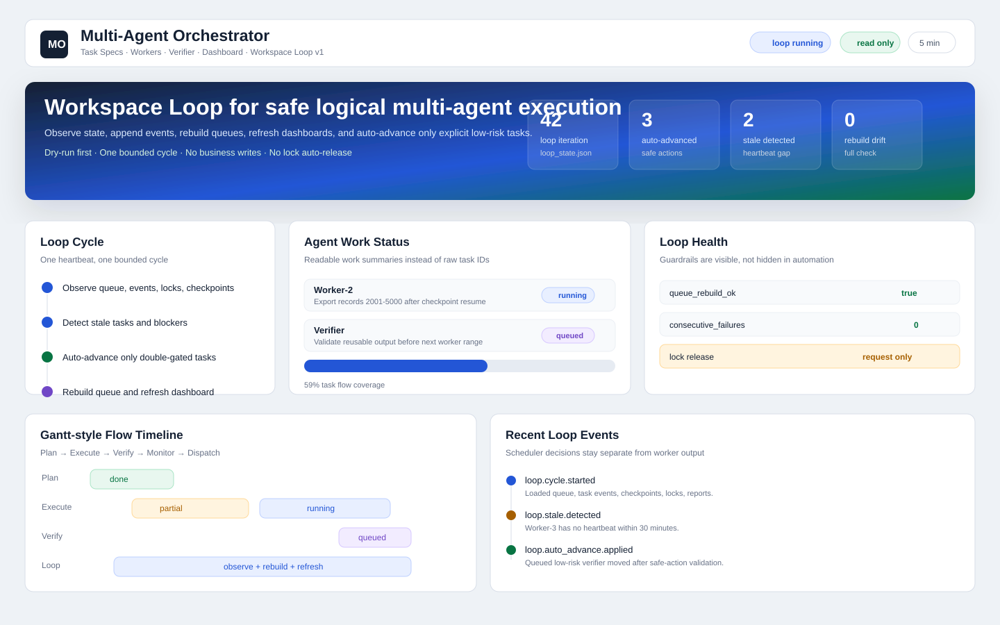
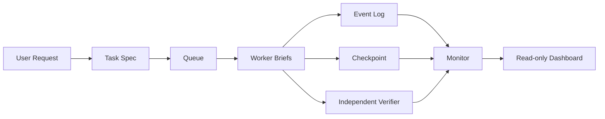

# Multi-Agent Orchestrator Skill

A practical Skill for coordinating logical multi-agent work inside one AI coding tool, with Task Specs, Worker Briefs, checkpoints, event logs, independent verification, and a read-only dashboard.

> 中文简介：这是一个面向 Codex、ClaudeCode、OpenClaw 等 AI 编程工具的多 Agent 协同 SKILL。它不创建真实后台进程，而是在同一个 AI 工具会话内，用 Coordinator / Worker / Verifier / Monitor / Dashboard 等逻辑角色，把长任务拆解、执行、验证、恢复和看板展示标准化。

[](https://github.com/lazze2026/multi-agent-orchestrator-skill)
[](LICENSE)
[](SKILL.md)
[](tests/simulations/dashboard-static-html/)



## Release Highlights

### v1.3.0

- Added a richer dashboard schema with `summary.metrics`, `entity_grid`, `display_dictionary`, `event_display_rules`, and `domain_extensions`
- Upgraded Agent cards to show `current_work`, `detail`, and `last_observed`
- Improved the static dashboard demo to render premium KPI cards, a generic entity matrix, better Chinese labels, and friendlier event names
- Extended the collector and validator so `state.json` can stay small for minimal cases but scale up for richer boards
- Kept the core protocol unchanged in spirit: dashboard stays read-only, business-specific fields stay outside the orchestration core

## Why This Exists

Long AI-agent tasks often become messy:

- The model loses track of which subtask is done.
- One worker's assumptions leak into verification.
- Partial output is repeated or forgotten after context compaction.
- The user cannot quickly see which agent is blocked and why.
- A failed verification accidentally turns into unauthorized auto-fixing.

This Skill gives those workflows a small operating protocol: plan first, execute within scope, log events, checkpoint progress, verify independently, and show status in a read-only dashboard.

## What You Get

- **Task Spec first**: scope, authorization, risk, allowed paths, forbidden actions, deliverables, acceptance criteria.
- **Worker Briefs**: bounded work cards with dependencies and reporting format.
- **State machine**: `queued`, `running`, `partially_completed`, `blocked`, `verifying`, `done`, `needs_human_decision`.
- **Event log**: append-only events with `caused_by` and `trigger_event_id`.
- **Checkpoint recovery**: resumable long-running work with idempotency checks.
- **Independent Verifier**: checks deliverables from the task spec, not from the worker's self-assessment.
- **Monitor warnings**: lock conflicts, stale agents, queue pressure, rate limits, fallback decisions.
- **Read-only dashboard**: Agent state, task breakdown, blockers, timeline, checkpoints, dispatch actions, recent events.
- **v1.3.0 dashboard schema**: top metrics, richer Agent cards, entity grid, display dictionary, event label rules, optional domain extensions.

## Quick Start

Clone or install the Skill into a shared skills directory:

```bash
git clone https://github.com/lazze2026/multi-agent-orchestrator-skill.git multi-agent-orchestrator
```

Then link or copy it into your tool's skills folder:

```text
~/.codex/skills/multi-agent-orchestrator
~/.claude/skills/multi-agent-orchestrator
~/.openclaw/skills/multi-agent-orchestrator
```

Use it when a task needs logical multi-agent coordination:

```text
Use multi-agent-orchestrator to split this long-running task into Task Spec, Worker Briefs, event log, checkpoint, verifier report, and dashboard state.
```

## Dashboard Demo

A static demo is included:

```bash
python -m http.server 8765 --bind 127.0.0.1 --directory tests/simulations/dashboard-static-html
```

Open:

```text
http://127.0.0.1:8765/index.html
```

The dashboard reads only `state.json`. It does not mutate queue, events, locks, reports, checkpoints, or task status.

In `v1.3.0`, the dashboard schema can also expose:

- `summary.metrics` for premium KPI cards
- `agents[].current_work`, `detail`, `last_observed`
- `entity_grid` for generic batch/module/shard matrix views
- `display_dictionary` and `event_display_rules` for better localized rendering
- `domain_extensions` for business-specific display additions without polluting the core protocol

The bundled static demo now shows:

- KPI cards across the top header
- Task groups split by completion state
- Agent cards with readable work summaries instead of raw task IDs only
- A horizontal gantt-like flow timeline
- A generic entity matrix suitable for tasks, batches, shards, or modules
- Recent events with display-layer labels

## Generate Dashboard State

Requirements:

- Python 3.9+
- No external dependencies; standard library only

Generate `state.json` from an orchestrator workspace:

```bash
python scripts/generate_dashboard_state.py ./workspace
```

Default output:

```text
./workspace/dashboard/state.json
```

Custom output:

```bash
python scripts/generate_dashboard_state.py ./workspace --output ./dashboard/state.json --refresh-interval 180
```

Validate a dashboard state file:

```bash
python scripts/validate_state.py ./workspace/dashboard/state.json
```

The validator understands the optional `v1.3.0` dashboard fields and still accepts the smaller minimal schema.

Linux/Mac wrapper:

```bash
chmod +x scripts/dashboard
scripts/dashboard ./workspace --output ./dashboard/state.json
```

Automated refresh:

```bash
# Linux/Mac
watch -n 180 python scripts/generate_dashboard_state.py ./workspace
```

```powershell
# Windows PowerShell
while($true) {
  python scripts/generate_dashboard_state.py ./workspace
  Start-Sleep -Seconds 180
}
```

## Typical Workflow



## Best Fit

Use this Skill for:

- Long-running AI coding tasks that need checkpoints.
- Batch work split by date range, module, file set, or data shard.
- Risky changes where implementation and verification should stay separate.
- Multi-step workflows with dependencies, locks, partial completion, or cancellation risk.
- Teams who want a visible Agent/task status board while one AI tool coordinates the work.

Avoid it for:

- Simple one-step tasks under about 10 minutes.
- Highly interactive work that needs constant user input.
- Work without clear authorization or acceptance criteria.
- Cross-tool orchestration. This Skill is intentionally scoped to logical agents inside one AI tool.

## Repository Map

```text
multi-agent-orchestrator-skill/
├── SKILL.md
├── agents/openai.yaml
├── references/protocol.md
├── references/templates/
├── scripts/
│   ├── generate_dashboard_state.py
│   ├── validate_state.py
│   └── dashboard
├── tests/simulations/
│   ├── api-rate-limit-partial-completion/
│   └── dashboard-static-html/
└── docs/
    └── install-codex-claudecode-openclaw.md
```

## Core Safety Rules

- `auto-approve` is not write authorization.
- Worker completion is not final completion; Verifier must review it.
- Verifier must not inherit Worker conclusions.
- Dashboard is read-only.
- Priority cannot bypass authorization, locks, dependencies, or verification.
- Cancellation is not rollback. Any deletion, overwrite, or database rollback is a separate authorized write action.

## Documentation

- [Skill entry point](SKILL.md)
- [Full protocol](references/protocol.md)
- [Install for Codex, ClaudeCode, and OpenClaw](docs/install-codex-claudecode-openclaw.md)
- [Dashboard simulation](tests/simulations/dashboard-static-html/)
- [API rate limit simulation](tests/simulations/api-rate-limit-partial-completion/)

## Release Notes

- `v1.0.0`: initial public release
- `v1.3.0`: dashboard schema and demo upgrade, richer display layer, collector and validator enhancements

## Community

Issues and pull requests are welcome. Before proposing a change, please read:

- [Contributing guide](CONTRIBUTING.md)
- [Security policy](SECURITY.md)
- [Code of conduct](CODE_OF_CONDUCT.md)

## License

MIT License. See [LICENSE](LICENSE).
